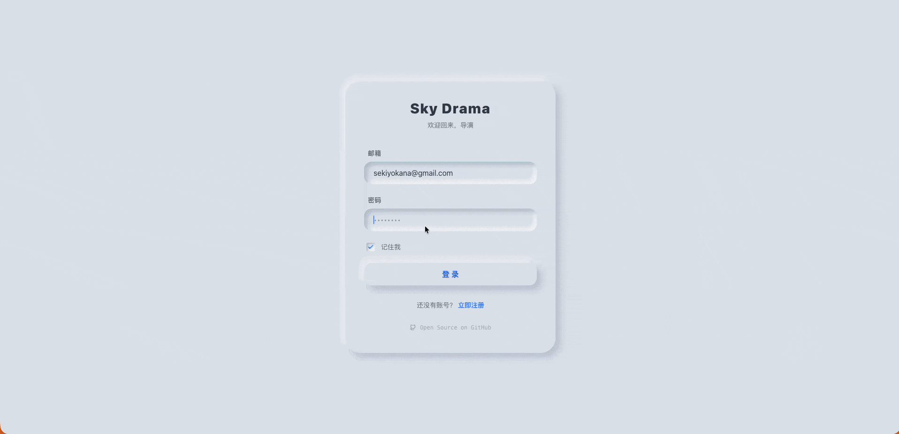
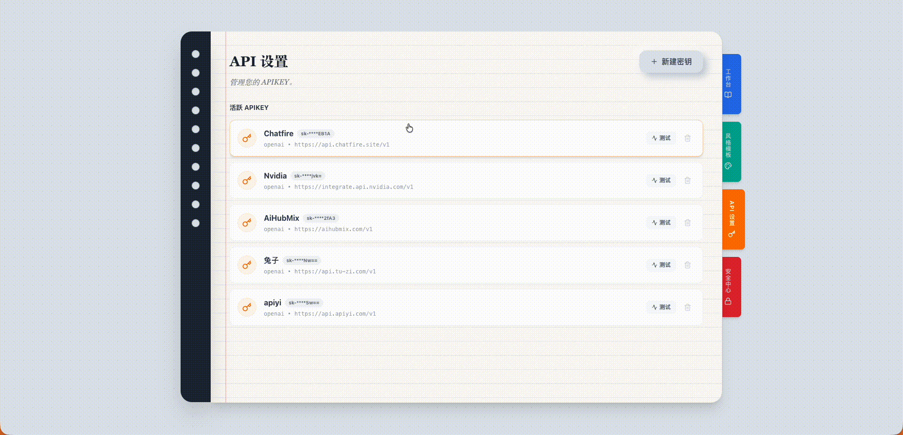
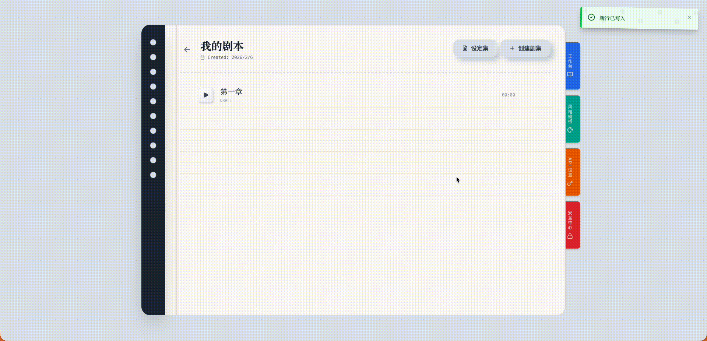
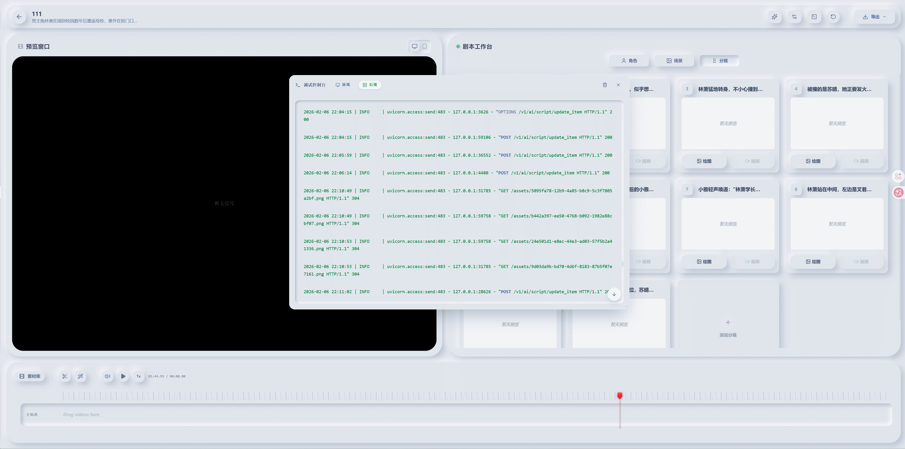

# Sky Drama ☁️🎬

<div align="center">


当前版本： 0.1.0 Beta 

**AI 驱动的短剧创作平台：从灵感到成片**

[](https://opensource.org/licenses/MIT)
[](https://vuejs.org/)
[](https://fastapi.tiangolo.com/)
[](https://github.com/SekiyoKana/sky-drama)

</div>

> **AI is cheap, show me your story.**
>
> **你的创意与思考远比 AI 的自动生成重要得多**。
>
> Sky Drama 的初衷并非制造“工业流水线的低质量产物”，而是作为真正的创作者的 AI 联合导演，辅助您将脑海中闪烁的故事火花，打磨成触动人心的作品。
>

## 📖 简介

**Sky Drama** 是一个集成的 AI 短剧创作平台，旨在彻底改变短剧创作流程。从最初的一个灵感火花，到完整可视化的分镜脚本和视频草稿，Sky Drama 将作为您的 AI 联合导演全程协助。

它填补了文本与视频之间的鸿沟，将编剧、视觉设计师和剪辑师的功能融合在一个流畅的“软拟态 (Neumorphism)”工作区中。

### 核心支持
- 🐳 **Docker Compose** 一键部署
- 🍎 **macOS App** (Beta) 原生体验
- 🪟 **Windows App** (Beta) 原生体验

---

## ✨ 核心功能与工作流

#### Sky Drama 当前版本强依赖于Nano Banana Pro + Sora2 api, 后续版本会接入更多模型。

### 1. 本地账号系统与项目管理
<div align="center">
   
</div>

### 2. 全局 API 配置
支持配置多种第三方服务提供商的 API Key，灵活切换生成引擎。
<div align="center">
   
</div>

### 3. 自定义您的视觉风格
上传参考图或使用预设，定义项目的整体视觉基调（如：赛博朋克、水墨风、皮克斯风格）。
<div align="center">
   
</div>

### 4. 拟物化界面风格
脱离标准SOP工作台模板的刻板印象，强调拟物化风格。
<div align="center">
   
</div>

### 5. 灵感转化为故事
输入一个简短的创意（Premise），AI 导演将为您扩写成完整的故事大纲，并基于大纲自动生成包含对白、动作指导和分镜描述的标准剧本格式。
<div align="center">
   
</div>

### 6. 角色与场景生成，使用@将场景于角色添加进分镜
一键生成角色立绘和场景概念图，保持角色一致性，支持使用@将场景和角色引入分镜参考，增强一致性。
<div align="center">
     
   
</div>

### 7. 可视化设定集
将登场人物和场景生成全局设定集，直观预览人物关系走向。
<div align="center">
   
</div>


### 8. 时间轴剪辑
内置非线性编辑 (NLE) 时间轴，拖拽素材，调整时长，实时预览最终成片。
<div align="center">
   
</div>

### 9. 应用内调试控制台（Beta）
内置前后端输出控制台，可以通过连续敲击5次Ctrl激活控制台
<div align="center">
   
</div>

---

## 🚀 快速开始

### 方式一：Docker Compose 部署 (推荐)

无需配置复杂的 Python/Node 环境，直接运行：

```bash
git clone https://github.com/SekiyoKana/sky-drama.git
cd sky-drama
docker-compose up -d
```

访问 `http://localhost:5173` 即可开始创作。

### 方式二：桌面应用 (Beta)

请前往 [Releases](https://github.com/SekiyoKana/sky-drama/releases) 页面下载对应平台的安装包, 或自行打包：
- **macOS**: `Sky-Drama-x.x.x.dmg`
- **Windows**: `Sky-Drama-setup-x.x.x.exe`

### 方式三：源码开发

#### 前置要求
- Node.js (v20+)
- Python (v3.12+)

#### 安装步骤

1. **克隆仓库**
   ```bash
   git clone https://github.com/SekiyoKana/sky-drama.git
   cd sky-drama
   ```

2. **后端设置**
   ```bash
   cd backend
   python -m venv venv
   source venv/bin/activate  # Windows: venv\Scripts\activate
   pip install -r requirements.txt
   
   # 运行服务
   uvicorn app.main:app --reload
   ```

3. **前端设置**
   ```bash
   cd frontend
   npm install
   npm run dev
   ```

---

## 🛠 技术栈

### 前端
- **框架**: Vue 3 (Composition API)
- **构建工具**: Vite
- **样式**: TailwindCSS + 自定义软拟态设计 (Neumorphism)
- **状态管理**: Pinia
- **路由**: Vue Router

### 后端
- **框架**: FastAPI (Python 3.12+)
- **数据库**: SQLAlchemy (SQLite default)
- **AI 集成**: 模块化 "Skills" 架构 (并非claude skills, 未来可能会支持)
- **验证**: Pydantic

## ⚠️ 注意事项

1. **视频模型支持**
   目前视频生成功能仅深度适配 **Sora 2** 模型。由于目前支持 Sora 2 的第三方 API 厂商数量较少，若您需要接入其他视频模型（如 Runway, Pika 等），请耐心等待后续版本的更新与适配。

2. **自定义 API 适配**
   Sky Drama 默认的 Sora 2 API 策略基于标准的 `/videos` (创建) 和 `/videos/{task_id}` (查询) 接口格式。
   
   如果您使用的第三方 API 厂商采用了不同的接口规范（例如：流式输出、WebSocket 或非标准端点），您需要自行编写 **转换器 (Formatter)** 进行适配。
   
   - **现有参考示例**: `backend/app/utils/sora_api/yi.py` (针对流式接口的适配实现)
   - **如何添加新转换器**:
     请在 `backend/app/utils/sora_api/` 目录下创建一个新的 Python 文件（例如 `my_provider.py`），并继承 `Base` 类实现以下逻辑：

     ```python
     # backend/app/utils/sora_api/my_provider.py
     from .base import Base
     from typing import List, Any, Dict

     class MyProvider(Base):
         name = "MyProvider"  # 在前端设置界面中显示的名称
         base_url_keyword = "api.myprovider.com"  # 用于自动识别的 URL 特征

         def create(self, base_url: str, apikey: str, model: str, prompt: str, seconds: int, size: str, watermark: bool, images: List[Any]) -> str:
             # 1. 设置认证信息
             self.set_auth(base_url, apikey)
             # 2. 调用您的第三方 API 创建任务
             # ...
             # 3. 返回任务 ID (task_id)
             return "task_123456"

         def _query_status(self, task_id: str) -> Dict[str, Any]:
             # 1. 调用第三方 API 查询任务状态
             # ...
             # 2. 返回统一格式的状态字典
             return {
                 "status": "completed", # 或 "processing", "failed"
                 "video_url": "https://...",
                 "progress": 100,
                 "fail_reason": None
             }
     ```

## 🗺️ 路线图
- [ ] **国际化I18N**: 支持中、英、日三国语言。
- [ ] **本地模型集成**: 支持通过 Ollama 调用本地大语言模型。
- [ ] **高级视频生成**: 支持更多视频模型的首尾帧控制、多图参考生成等高级功能。
- [ ] **时间轴增强**: 支持在时间轴剪辑中添加过渡动画效果。
- [ ] **深度日志**: 提供更详细的 Console 日志和导演工作台 (Director Workbench) 执行记录，便于调试与回溯。
- [ ] **工程管理**: 支持工程文件的完整导出、迁移及备份。
- [ ] **自定义创作**: 支持自定义提示词 (Prompt) 模板与工作流。
- [ ] **工具箱扩展**: 集成更多的 AI 辅助工具。
- [ ] **多模型支持**: 在 Sora, Runway, Pika，keling，vidu，jimeng 等视频模型间无缝切换。
- [ ] **声音克隆**: 为角色生成专属 AI 配音。

## 📄 许可证

本项目采用 MIT 许可证。


<div align="center">
   
</div>